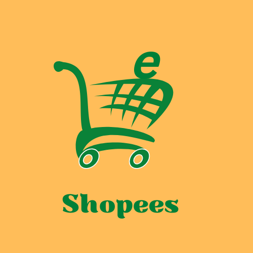

<!-- PROJECT LOGO -->
 

  

  <h3 align="center">eShopees</h3>

Demo Link: [https://eshopees.vardaneducationandtrust.in/](https://eshopees.vardaneducationandtrust.in/)

<!-- ABOUT THE PROJECT -->
## About The Project

Ecommerce website just like flipkart. Simple admin panel.

Here's why:
* To simplify resell and payments with ease. :smile:

### Built With
This section should list any major frameworks that you built your project using. Leave any add-ons/plugins for the acknowledgements section. Here are a few examples.
* [Bootstrap](https://getbootstrap.com)
* [JQuery](https://jquery.com)
* [Laravel](https://laravel.com)

<!-- LICENSE -->
## 📝 License
Describe your License for your project. 

See `LICENSE` for more information.

<!-- CONTACT -->
## 📫 Contact

Your Name - Sachin Bhoi - givesachin@gmail.com

Project Link: [https://github.com/givesachin/eShopees](https://github.com/givesachin/eShopees)

